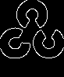
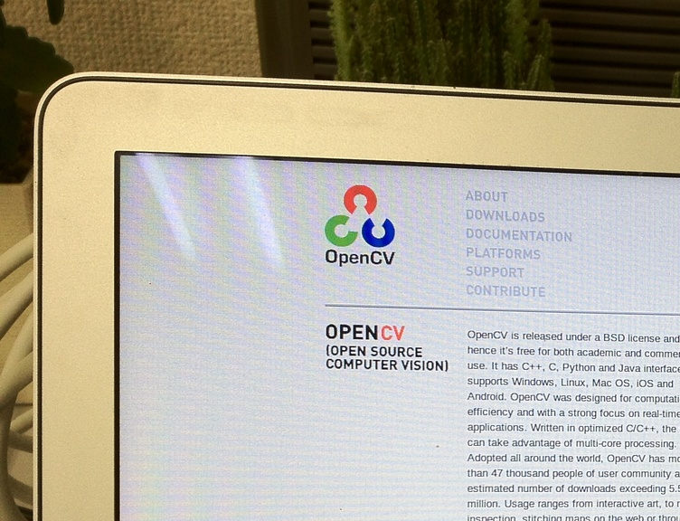
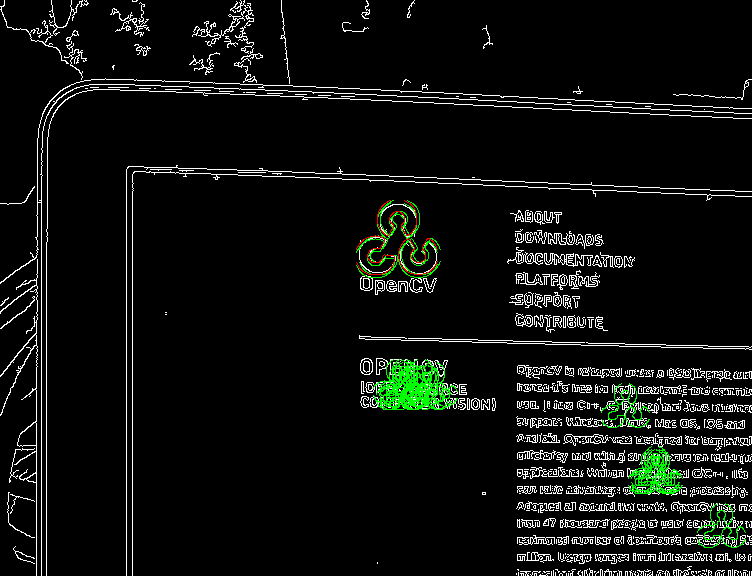

cv::chamerMatching() のサンプル
================================================================================

サンプル要素
--------------------------------------------------------------------------------

- cv::chamerMatching の使い方
- OpenCV と C++11 の組み合わせ

Chamfer Matching
--------------------------------------------------------------------------------
Chamfer Matching はエッジ画像同士のマッチングを行うアルゴリズムです。

テンプレートマッチングがテンプレート画像と探索画像の対応画素の画素値を評価するのに対して、Chamfer Matching はテンプレート画像の各エッジ画素について、探索画像中でもっとも近い座標にあるエッジ画素との距離を評価します。

実際の処理では評価後とに2つの座標間の距離を求めることはせず、距離変換（Distance Transform）の結果を用いて処理を効率化しています。

参考

- `Hierarchical Chamfer Matching: A Parametric Edge Matching Algorithm <http://www.cs.berkeley.edu/~malik/cs294/borgefors88.pdf>`_
- `弱識別器の応答に基づく類似シルエット画像選択によるChamfer Matchingを用いた人領域のセグメンテーション <http://www.vision.cs.chubu.ac.jp/04/pdf/PIA41.pdf>`_

注意
--------------------------------------------------------------------------------

- cv::chamerMatching は OpenCV 2.4.3 の時点で contrib 扱いです。
- 関数名が cv::chamerMatching() となっています。
	クラス版では cv::ChamferMatcher となっていますがヘッダは公開されていません。
	以降のバージョンで関数名が修正されるかもしれません。
- パラメータのドキュメンテーションが未完了のためサンプルもわかる範囲で作成しています。

コンパイル環境
--------------------------------------------------------------------------------

- C++11にそこそこ対応したC++コンパイラ（g++ 4.6.3でコンパイル確認済）
- OpenCV 2.4.0 以降
- 添付 makefile はLinux用

動かし方
--------------------------------------------------------------------------------

コンパイルができたら以下のように実行します．::

	# テンプレート画像と探索画像を渡す
	./chamfer.bin sample/opencv_logo_edge.png sample/photo_part_50p.jpg

このプログラムは以下のことを行います。

- テンプレート画像と探索画像をグレイスケールで読み込みます。
- 探索画像をCannyエッジ抽出で線画化します。
- cv::chamerMatching() を用いてテンプレート画像がマッチする位置を20抽出します。
- 20の結果のコストを表示します。
- ベスト以外の結果を緑で描画します。
- ベストの結果を赤で描画します。
- ベストの結果を画像として表示します。
- ベストの結果を画像として、実行ディレクトリに out.png というファイル名で保存します。

テンプレート画像はあらかじめCannyエッジ抽出などで線画化しておいてください。
探索画像はプログラム内でエッジ抽出しています。

動作結果
--------------------------------------------------------------------------------

テンプレート画像

探索画像

出力画像

