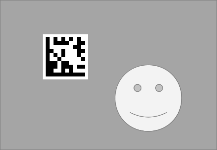
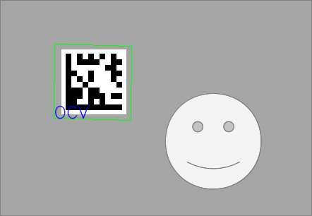

Data Matrix読み取りのサンプル
================================================================================

サンプル要素
--------------------------------------------------------------------------------

- cv::findDataMatrix() を用いたData Matrixの読み取り

Data Matrix
--------------------------------------------------------------------------------
QRコードに似た二次元バーコード。電子部品のラベルなど広く使われている。

注意
--------------------------------------------------------------------------------
DataMatrix自体は英数字だと2335文字を記述できるが、OpenCVのcv::findDataMatrix()は2.4.3の実装だと3文字のコードまでしか読み取りができない。

参考
- Data Matrix - Wikipedia, the free encyclopedia
	http://en.wikipedia.org/wiki/Data_Matrix
- 2次元コードの基礎知識 - Data Matrix（データ・マトリクス） : バーコードホットライン
	http://www.keyence.co.jp/barcode/2jigenbasic/chishiki5.html

コンパイル環境
--------------------------------------------------------------------------------

- C++11にそこそこ対応したC++コンパイラ（g++ 4.6.3でコンパイル確認済）
- OpenCV 2.4.0 以降
- 添付 makefile はLinux用

動かし方
--------------------------------------------------------------------------------

コンパイルができたら以下のように実行します．::

	# コマンド ファイル名
	./datamatrix ../../images/ocv_datamatrix.png

	検出した領域の行列と、コードの出力を行います。

	入力画像と検出結果画像を出力します。

動作結果
--------------------------------------------------------------------------------

入力画像のグレイスケール

検出結果の描画

