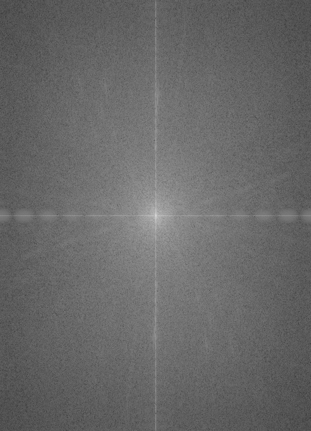
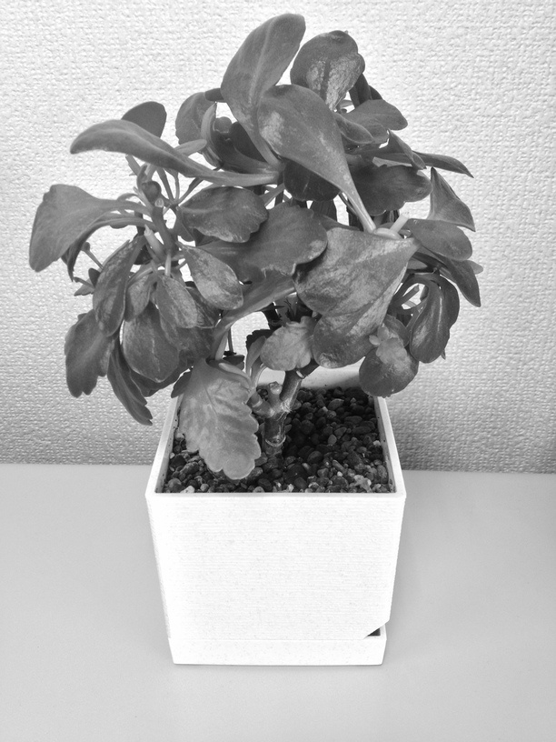

離散フーリエ変換のサンプル
================================================================================

サンプル要素
--------------------------------------------------------------------------------

- 離散フーリエ変換、逆変換の関数であるcv::dft()、cv::idft()の使い方

OpenCVのフーリエ変換
--------------------------------------------------------------------------------

OpenCVが提供するcv::dft()、cv::idft()で離散フーリエ変換と逆変換を行うことができる。
これは1xN行列（波形データなど）にもMxN行列（画像など）にも適用することができる。

離散フーリエ変換の特性として、入力行列のサイズ（2次元であれば行数・列数それぞれ）が処理に適した数字である必要がある。このためにcv::getOptimalDFTSize()を用いて元データのサイズから適切なサイズを求め、元データを新たな適切なサイズの行列にコピーする。このとき、元データにない要素は0で埋める。

コンパイル環境
--------------------------------------------------------------------------------

- C++11にそこそこ対応したC++コンパイラ（g++ 4.6.3でコンパイル確認済）
- OpenCV 2.4.0 以降
- 添付 makefile はLinux用

動かし方
--------------------------------------------------------------------------------

コンパイルができたら以下のように実行します．::

	# ./dft_idft [処理したい画像のパス]
	./dft_idft.bin ../../images/plant.jpg

サンプルプログラムは入力画像に対して離散フーリエ変換を行い結果を表示します。

さらに離散フーリエ変換の結果に対して逆変換を行い結果を表示します。離散フーリエ変換の逆変換により入力画像を復元できることを確認できます。

離散フーリエ変換、逆変換のそれぞれの結果画像を保存します。

動作結果
--------------------------------------------------------------------------------

入力画像のグレイスケール

.. image:: ../../images/plant_gray.jpg
	:target: ../../images/plant_gray.jpg

離散フーリエ変換

逆変換

