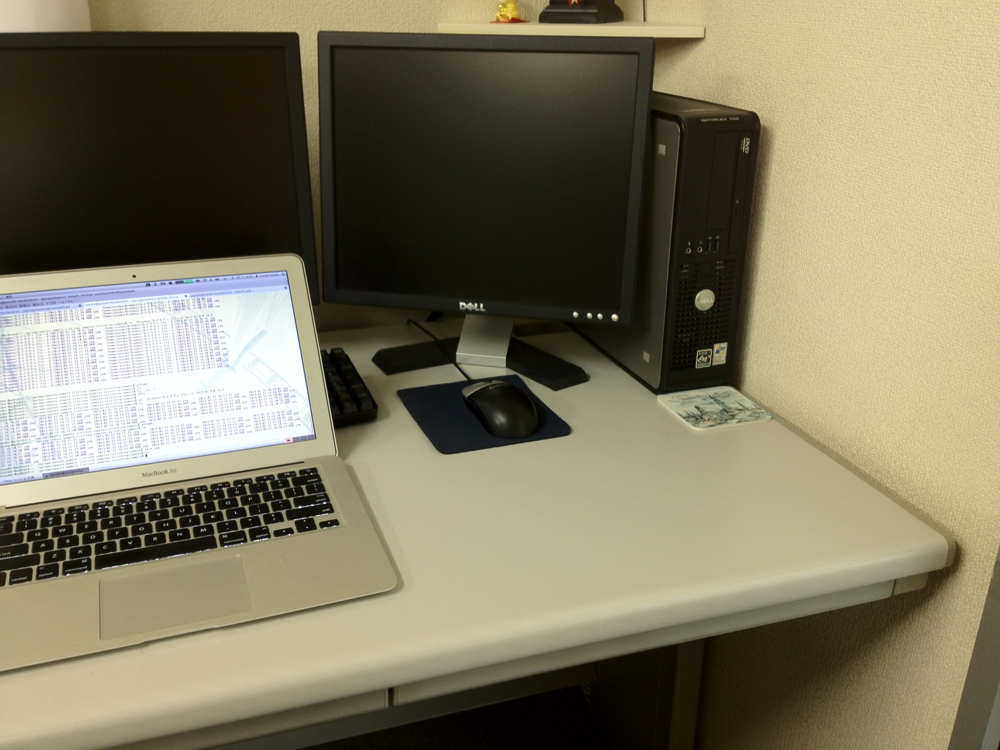
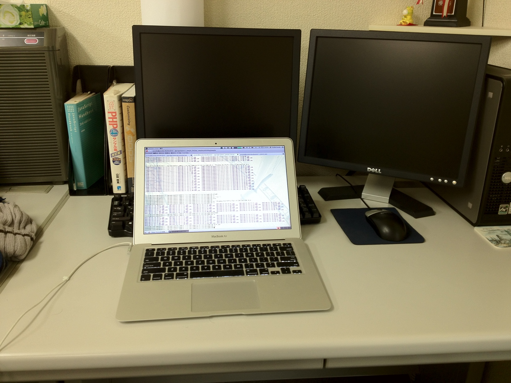
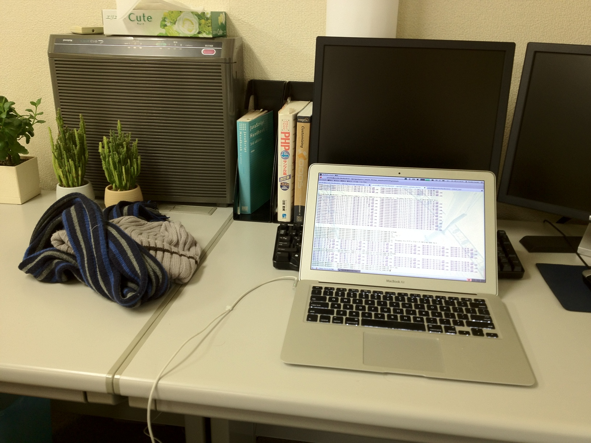
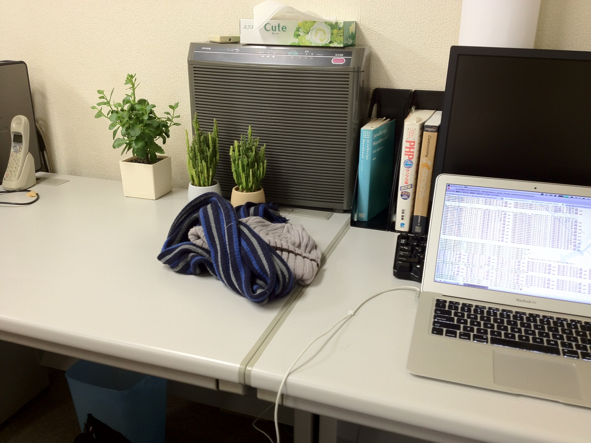
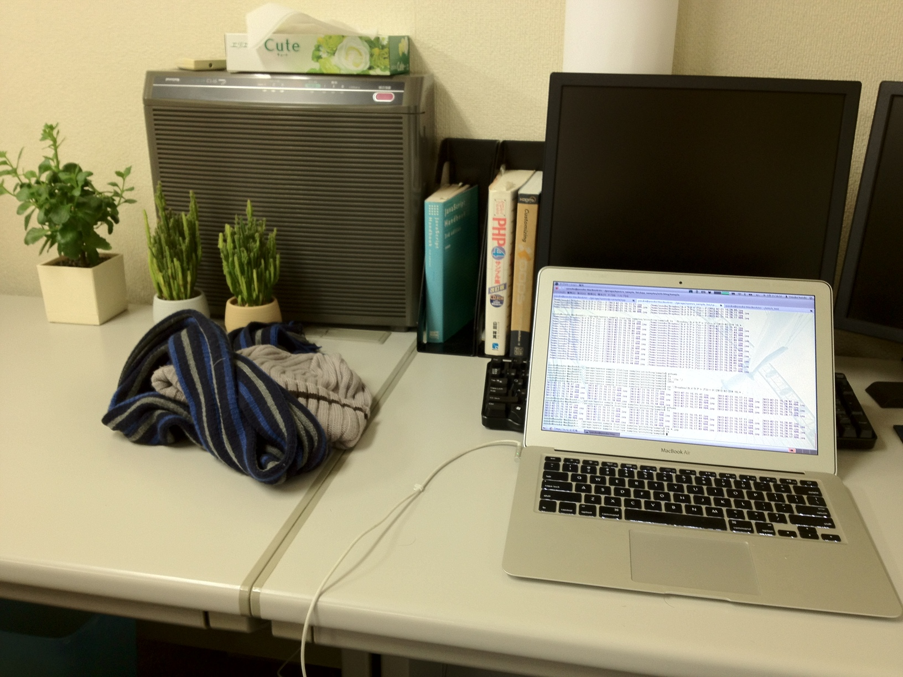
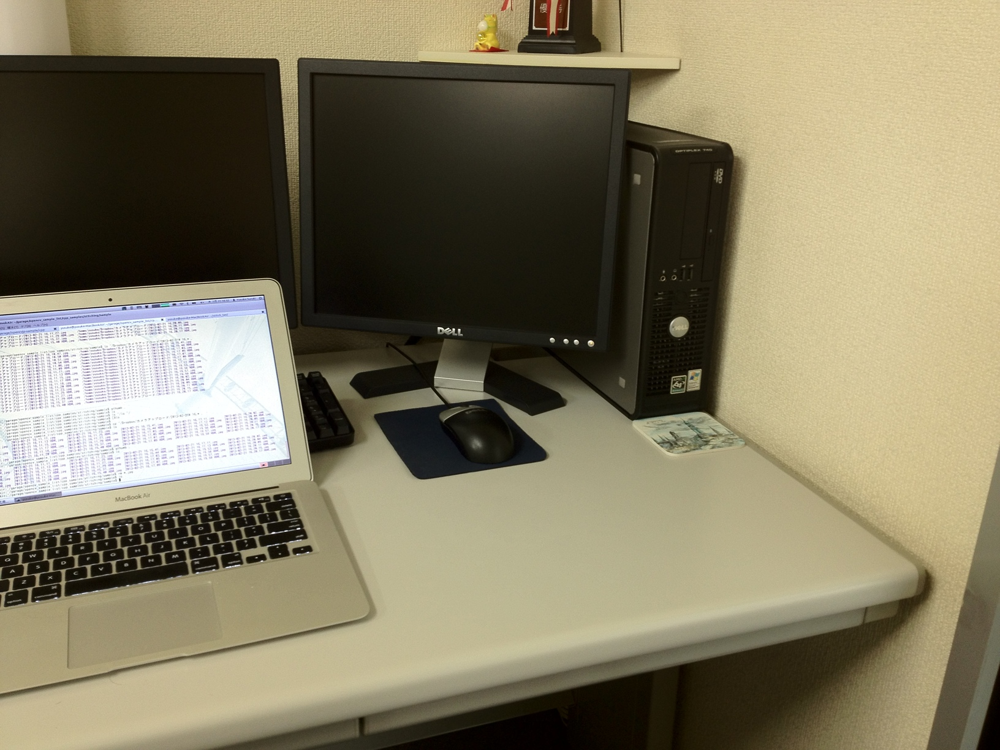
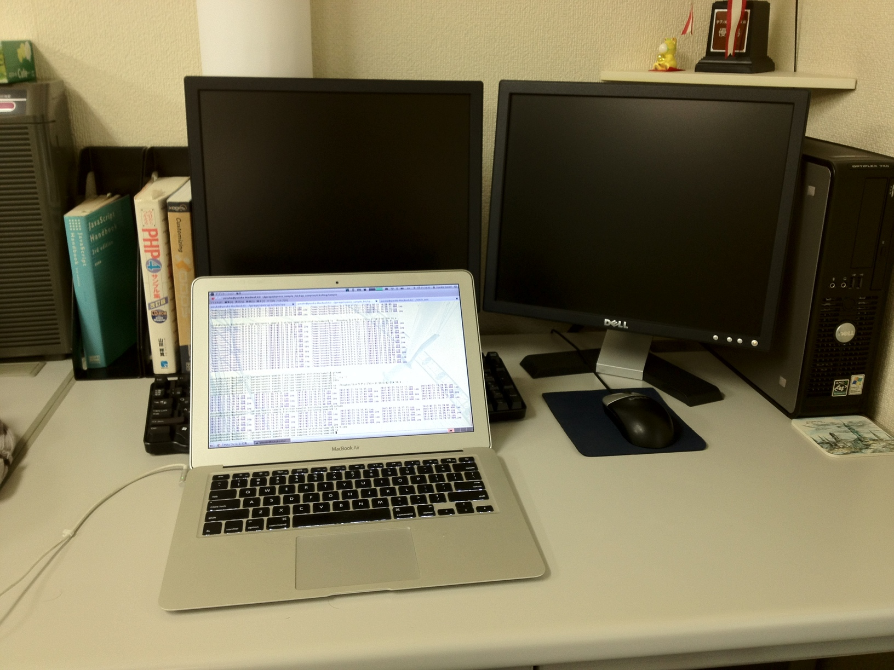
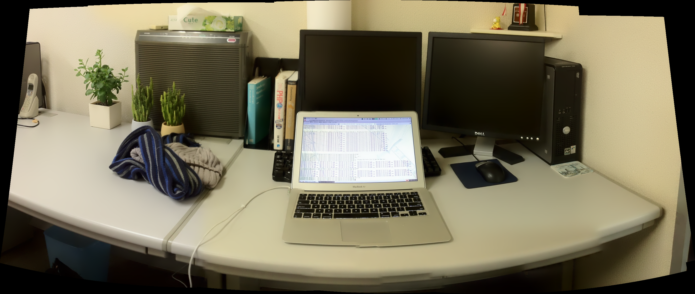

cv::Stitcher のサンプル
================================================================================

サンプル要素
--------------------------------------------------------------------------------

- cv::Sticher の使い方
	cv::Stitcher はイメージスティッチングを行うためのクラスです．
	パラメータを設定しなくてもそこそこの処理結果を出してくれます．
	詳細なパラメータの設定のサンプルは OpenCV 添付の stitching_detailed.cpp を参考にするのがいいでしょう．
- cv::CommandLineParser の使い方
	cv::CommandLineParser はコマンドライン引数を解析してオプション名とその値（--out=output.pngであればオプション名"out"と値"output.ong"）の対応づけを行います。いまのところ若干使い勝手が悪いです。
- OpenCV と C++11 の組み合わせ

コンパイル環境
--------------------------------------------------------------------------------

- C++11にそこそこ対応したC++コンパイラ（g++ 4.6.3でコンパイル確認済）
- OpenCV 2.4.0 以降
- 添付 makefile はLinux用

動かし方
--------------------------------------------------------------------------------

コンパイルができたら以下のように実行します．::

	# --imagesに入力画像をカンマ区切りで列挙する
	./stitching.bin --images=pic1.jpg,pic2.jpg,pic3.jpg,pic4.jpg,pic5.jpg

	# OpenCV 添付のサンプルで使用される imagelist 形式の入力にも対応します。
	./stitching.bin --imagelist photos.yml

	# --out オプションで出力ファイル名・ファイル形式を指定できます
	./stitching.bin --imagelist photos.yml --out panorama.jpg

動作結果
--------------------------------------------------------------------------------

入力画像

|pic1| |pic2| |pic3| |pic4| |pic5| |pic6| |pic7| 

出力画像

